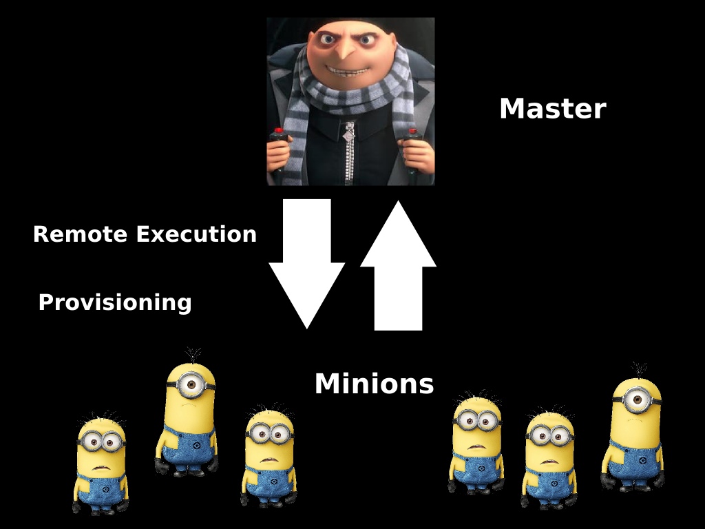

# Salty Servers Taste Better

Sebastian Vetter

@elbaschid

.fx: titleslide

---

## Who am I?

* I work for Tangent Snowball
* I love Python & Django
* I passionate about CI & CD
* I hate doing things by hand

---
## Disclaimer

* I am **not** a DevOp
* I don't know much about puppet/chef
* This presentation might suck ;)

---

# Who has heard about saltstack?

---

## Why am I talking about salt?

Because

1. it is awesome!
2. it is magic!
2. I love automation!
3. it is awesome!

---

## What I'll be talking about today

* The basics of salt ...

* ... and how to use it **everywhere** 

---

## Check out this freshly squeezed talk

---

## Two Types of Servers

---

## 4 Major Parts

* Modules

* Grains

* Salt states

* Pillar

---

## Modules

* remote execution
* administration from master
* run on selected minions

---

## Grains provide

* hostname
* OS details
* roles of the host

---

## Grains example

    !css+jinja
    {{ grains['oscodename'] }}

---

## Salt states define

* installed packages
* managed files
* running services
* ... and more ...

---

## Salt state examples

    !yaml
    redis:
      pkg.installed:
        - name: redis-server
      service.running:
        - name: redis-server
        - enable: True
        - require:
          - pkg: redis

---

## Pillars

* define sensitive data
* are selective distribution
* can be used in 

---

## Pillar example

    !scheme
    database:
      prefixes:
        - dev
        - test

---

## Get Pillar data

    !css+jinja
    {{ salt['pillar.get']('database:prefixes:dev', None) }}

---

## The master configuration

    !yaml
    # define the salt state director(y|ies)
    file_roots:
      base:
        - /srv/salt

    # define the pillar director(y|ies)
    pillar_roots:
      base:
        - /srv/salt

---

## The minion configuration

    !yaml
    master: 127.0.0.1

---

## ``/srv/salt/top.sls``

* main entry point
* one each for pillar and salt
* must be in pillar/salt roots

---

## An example

    !scheme
    base:
      '*':
        - core
        - python
        - ssh
        - iptables

      'coolsite-*':
        - nginx
        - supervisor
        - virtualen

      'os:Windows':
        - destroy

---

# Here comes the magic

    !sh
    $ salt '*' state.highstate

---

# What else can you do

* share states through **gitfs**
* handle your cloud with ``salt-cloud``
* provision vagrant or docker

---
# Thanks for listening

# Got Questions?

.fx: titleslide
